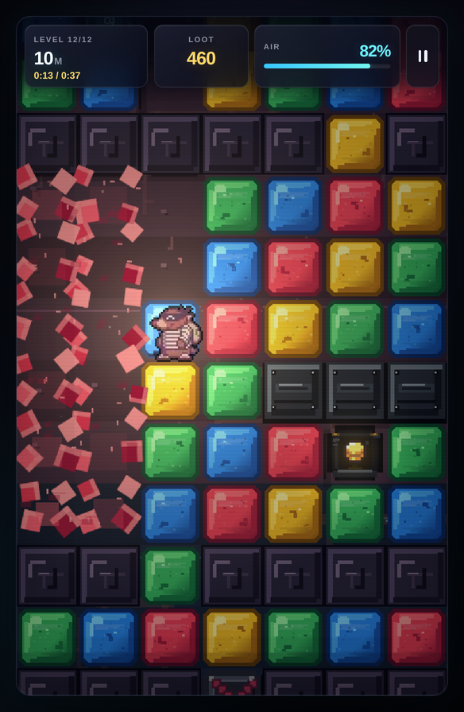
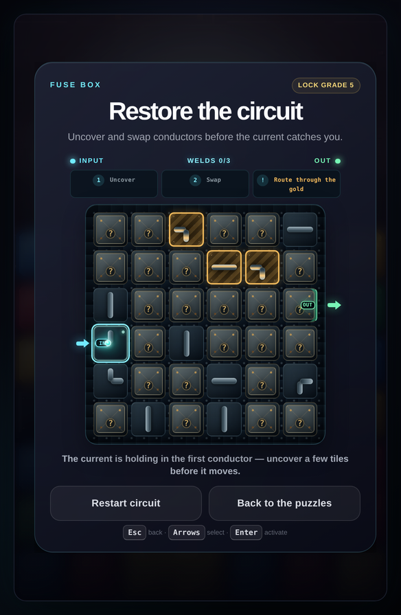
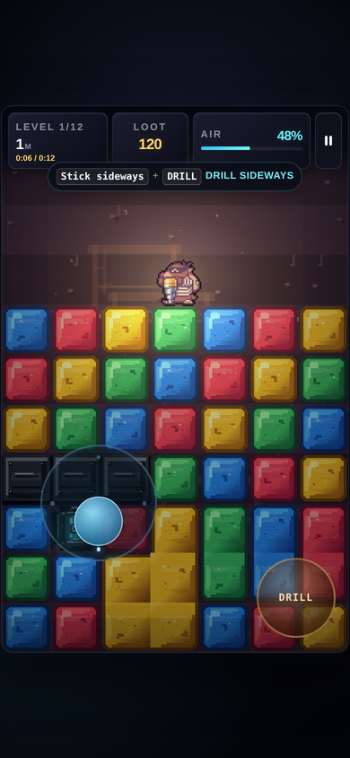

# Manny the Mole — Vault Run

*A mole. A drill. Somebody else's safe.*

A Mr. Driller-style digging game where every level ends in a lock you pick.
Dig down through twelve shafts of colour-matched blocks while your air runs
out and the ceiling comes down behind you — then crack the timed circuit
lock on the safe at the bottom.

  
  
  

## Play

The whole game is static files — no build step, no server, no dependencies.

- **In a browser:** open `index.html`.
- **As one file:** `python3 tools/build-bundle.py` writes a single
  self-contained HTML file with every sprite and sound inlined. It runs
  offline and makes zero network requests.

## What's in it

- **Twelve levels**, hand-authored as ASCII maps in `levels.js`, with ore
  seams that break up to twelve blocks in one bite, heavy blocks that cost
  air to crack, and cave-ins that give one warning.
- **The circuit lock** — a timed routing puzzle in six grades, from a 4×4
  introduction to a branching board that must feed two outlets. Every
  campaign safe runs one; a wire bank variant lives in the puzzle menu.
- **A run clock** coloured by the medal still in reach, gold–silver–bronze
  medals per descent, a *Time Owed* ledger that ranks every shaft by how
  far it sits off gold, 31 trophies, and a gallery of the strange things
  the safes were holding.
- **Touch and keyboard.** On phones the stick spawns under your thumb.
  The frame is locked to 7:11 and scales to any screen.

## Controls

| | Keyboard | Touch |
|---|---|---|
| Move | ← → ↓ | drag the stick |
| Drill | Space + a direction | DRILL button + stick |
| Pause | P or Esc | pause button |

## Credits

- **Manny and his animations** — hand-drawn by
  [**Alex_Greenfield**](https://www.reddit.com/user/Alex_Greenfield/).
  The mole is not generated; he has an author.
- **Everything else** — code, level design, the lock puzzles, the vault
  loot and title artwork, the trophy and UI sprites, and the procedural
  sound — built with [Claude Code](https://claude.com/claude-code) in an
  AI-assisted workflow: hand-rolled canvas engine, no libraries, no game
  framework.

## Feedback

This game is out to be torn apart. If the difficulty curve lies to you,
the lock interruption grates, or the touch controls fight your thumbs —
open an issue and say so plainly.
